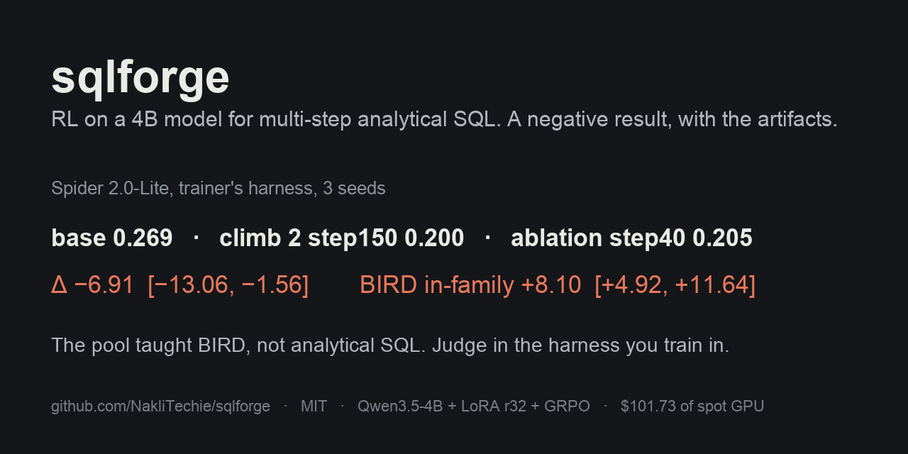

<h1 align="center">sqlforge</h1>

**A GRPO training environment for multi-step analytical SQL on Qwen3.5-4B, and the negative result it produced: two climbs and one ablation, none beat the base on Spider 2.0-Lite.**

One repo, one verifier, one judge. SQLite databases on your disk. No account, no server, no telemetry.



## Install

| platform | command |
|---|---|
| macOS / Linux, Python 3.12 | `git clone https://github.com/NakliTechie/sqlforge && cd sqlforge && uv sync` |
| GPU box (vLLM rollouts) | `uv pip install "vllm==0.30.0" ninja "transformers==5.17.0"` after the line above |

Run the base model through the harness on the hand-made tasks with a local Ollama or any OpenAI-compatible server; the runner
writes one JSON per episode under `runs/<tag>/` and a summary with exec accuracy, per-gate failures and turn-cap rate:

```bash
uv run python -m lab.run --model qwen3.5:4b --taskfile lab/climb1_eval.json --seeds 1 --max-turns 25 --tag smoke
```

No config file, no account, no download beyond the model. The benchmark data (Spider 2.0-Lite SQLite, BIRD Mini-Dev, TPC at
scale 0.1) is fetched by the scripts in `lab/` when you ask for it; the task files that reference it are already in `lab/`.

## Why

You want to know whether a small model can be trained, by reinforcement learning alone, to plan and assemble a multi-step SQL
answer, and you do not want to trust a steering curve. This repo is the apparatus for that question: a two-tool harness
(`run_sql`, `submit`), a deterministic verifier that runs the submitted SQL against the database, a GRPO trainer with
in-process vLLM rollouts, and a pre-registered, database-clustered judge. It is also the record of the answer we got: no.

Use something else if you want a text-to-SQL model to deploy: [Arctic-Text2SQL-R1](https://huggingface.co/Snowflake/Arctic-Text2SQL-R1-7B)
and [SkyRL-SQL](https://github.com/NovaSky-AI/SkyRL) publish trained checkpoints with BIRD numbers above anything here. Use
[verl](https://github.com/volcengine/verl) or [TRL](https://github.com/huggingface/trl) if you want a general RL trainer; this one
is a few hundred lines built for one experiment.

## What the experiment found

Climb 1 (100 steps, synthetic pool) saturated its pool and transferred nothing. Climb 2 (150 steps, 521 real-schema tasks with
measured base pass@8 in (0, 1)) gained 8 points on BIRD Mini-Dev and lost on Spider 2.0-Lite: in the trainer's own harness,
step 150 scores 0.200 against the base's 0.269, Δ −6.91, 95 % CI [−13.06, −1.56]. The judge harness we had used until then
under-reads the base by 10 points. Ablation 1 removed the no-submit penalty and reproduced the loss at 40 steps, so the pool,
90 % BIRD-train, is the cause. Numbers, strata and transitions: [`reports/sqlforge-report-2026-09-28.md`](reports/sqlforge-report-2026-09-28.md).
Adapters and per-task judge outputs: [huggingface.co/naklitechie/sqlforge](https://huggingface.co/naklitechie/sqlforge).

## Judge a checkpoint

`lab/judge_stats.py` takes per-task outcome files from two arms and reports the paired difference with a 30-database cluster
bootstrap, exact McNemar and a database sign-flip test, plus seen-schema and base-reachable strata. The Spider 5-seed sweep and
the in-process diagnostic in the report were produced with it; the command lines are in the report.

## Commands

```bash
uv run python -m lab.selfcheck                          # verifier ladder: 30/30 golds pass, 30/30 hardcoded answers fail
uv run python -m train.selfcheck                        # trainer: masks, log-probs, OOM-skip, context guard, task_env
uv run python -m lab.run --model M --taskfile F --seeds 1,2,3 --max-turns 25 --tag T   # measure a model in the harness
uv run python -m lab.judge_stats --tasks F --base A.jsonl --treat B.jsonl               # paired, clustered comparison
uv run python -m train.run_train --model Qwen/Qwen3.5-4B --tasks F --rollout vllm ...   # one GRPO climb (GPU)
uv run python infra/judge_inprocess.py --tasks F --adapter DIR --seeds 1,2,3            # judge in the trainer's harness
```

`infra/*-startup.sh` are the GCP spot-VM jobs (climbs, judges, pass@8 measurements); they expect the bucket layout in the report.

## Verify it yourself

```bash
uv run python -m lab.selfcheck && uv run python -m train.selfcheck
```

The first refuses any gold SQL that fails its own verifier and any hardcoded visible answer; the second refuses a trainer whose
gradient-checkpointed log-probs drift from the reference or whose lockstep loop mishandles the 32k context cap. The judge numbers
in the report replay from the per-task files with the `judge_stats` command in the model card.

## License

MIT. Founding document and results: [`reports/sqlforge-report-2026-09-28.md`](reports/sqlforge-report-2026-09-28.md) · reviews:
[`reports/`](reports/) · lab notebook: `plan/` (private) · artifacts: [Hugging Face](https://huggingface.co/naklitechie/sqlforge).
